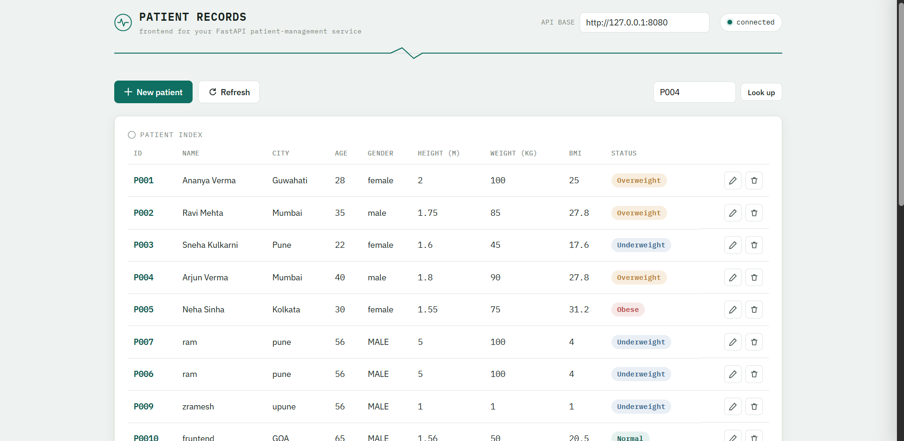

# Patient Management API

A small CRUD API built with **FastAPI** and **Pydantic** for managing patient records — create, view, sort, and update patients, with BMI and a health "verdict" computed automatically. Built as a learning project for FastAPI + Pydantic fundamentals.

## Features

- Create, view, update, and sort patient records


- Request/response validation handled by Pydantic models
- BMI and a weight-category verdict computed as a Pydantic `computed_field`
- Data persisted to a local `patients.json` file — no external database needed

## Tech Stack

- [FastAPI](https://fastapi.tiangolo.com/) — web framework
- [Pydantic](https://docs.pydantic.dev/) — data validation & serialization
- [Uvicorn](https://www.uvicorn.org/) — ASGI server

## Project Structure

```
fast-api/
├── main.py         # FastAPI app: routes, Pydantic models, JSON I/O
├── patients.json   # Patient records (acts as the database)
└── README.md
```

## Getting Started

### Prerequisites
Python 3.9+

### Installation

```bash
git clone https://github.com/siddheshwarkhandare/fast-api.git
cd fast-api
pip install fastapi uvicorn pydantic
```


### Run it

```bash
uvicorn main:app --reload
```

- API: `http://127.0.0.1:8000`
- Interactive docs (Swagger UI): `http://127.0.0.1:8000/docs`

## API Reference

| Method | Endpoint | Description |
|---|---|---|
| GET | `/` | Welcome message |
| GET | `/about` | Short description of the API |
| GET | `/view` | Returns all patient records |
| GET | `/patients/{patient_id}` | Returns one patient by ID, e.g. `P001` (404 if missing) |
| GET | `/sort` | Sort patients — see query params below |
| POST | `/create` | Create a new patient |
| PUT | `/edit/{patient_id}` | Update an existing patient |

**`GET /sort` query params:**
- `sort_by` — one of `hieght` *(sic — see Known Issues)*, `weight`, `bmi`
- `order` — `asc` (default) or `desc`

**Patient fields (`POST /create` body):**

| Field | Type | Notes |
|---|---|---|
| `id` | string | Unique ID, e.g. `"P008"` |
| `name` | string | |
| `city` | string | |
| `age` | int | 1–119 |
| `gender` | string | `"MALE"`, `"FEMALE"`, or `"other"` |
| `height` | float | Meters |
| `weight` | float | Kilograms |

`bmi` and `verdict` are **not** part of the create model — a patient created via `POST /create` won't have them until it's later saved through `PUT /edit`, which does compute and store both.

### Example: create a patient


```bash
curl -X POST http://127.0.0.1:8000/create \
  -H "Content-Type: application/json" \
  -d '{
    "id": "P008",
    "name": "Kiran Patil",
    "city": "Nagpur",
    "age": 32,
    "gender": "MALE",
    "height": 1.72,
    "weight": 68
  }'
```

### Example: sort patients by BMI, descending

```
GET /sort?sort_by=bmi&order=desc

```

## Known Issues

These were confirmed by running the code directly rather than just reading it, so a future cleanup pass can target them specifically:

1. **`PUT /edit/{patient_id}` fails for most existing patients.** The endpoint lowercases `gender` (e.g. `"MALE"` → `"male"`) before rebuilding the patient object, but the underlying model only accepts `"MALE"`, `"FEMALE"`, or `"other"` (mixed case). The mismatch raises an unhandled `ValidationError` (HTTP 500) for any patient whose gender is male or female — which is nearly all of them in the sample data.
2. **Supplying `gender` in a `PUT /edit` request body always fails validation.** `PatiantUpdate` uppercases the input first, then checks it against a lowercase-only `Literal["male", "female", "others"]` — so no string value can pass both steps.
3. **`sort_by` has a typo that changes its behavior.** The accepted value is the misspelled `hieght`, not `height` — passing the correctly spelled `height` returns a 400. Passing `hieght` is accepted but doesn't actually sort, since patient records store the key as `height`; the lookup silently falls back to a default and the original order is preserved.
4. **The BMI verdict mislabels the overweight range as "normal".** For a BMI between 25 and 30 — the standard "overweight" range — `verdict` returns `"normal"` (lowercase), while BMI under 25 returns `"Normal"` (capital N). Both are distinct from `patients.json`'s own pre-filled `verdict` values (e.g. `"Overweight"`), which appear to have been entered by hand rather than produced by this code.
5. **No `requirements.txt`, tests, or auth** — expected for a learning project, but worth knowing before treating this as production-ready.

